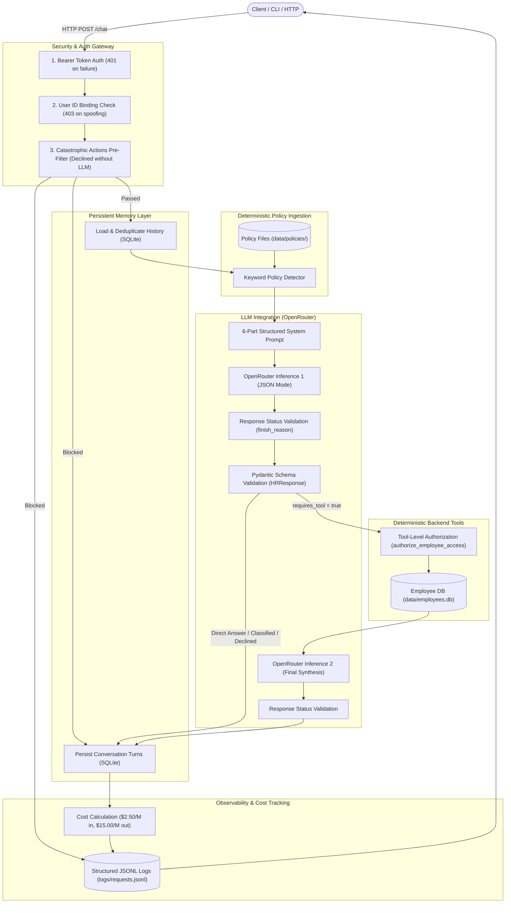
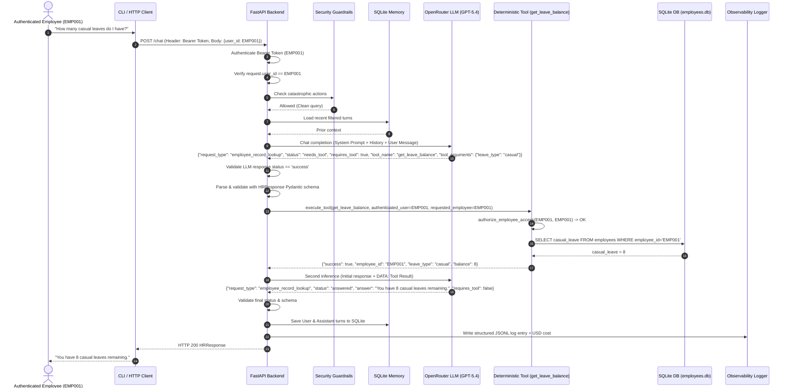
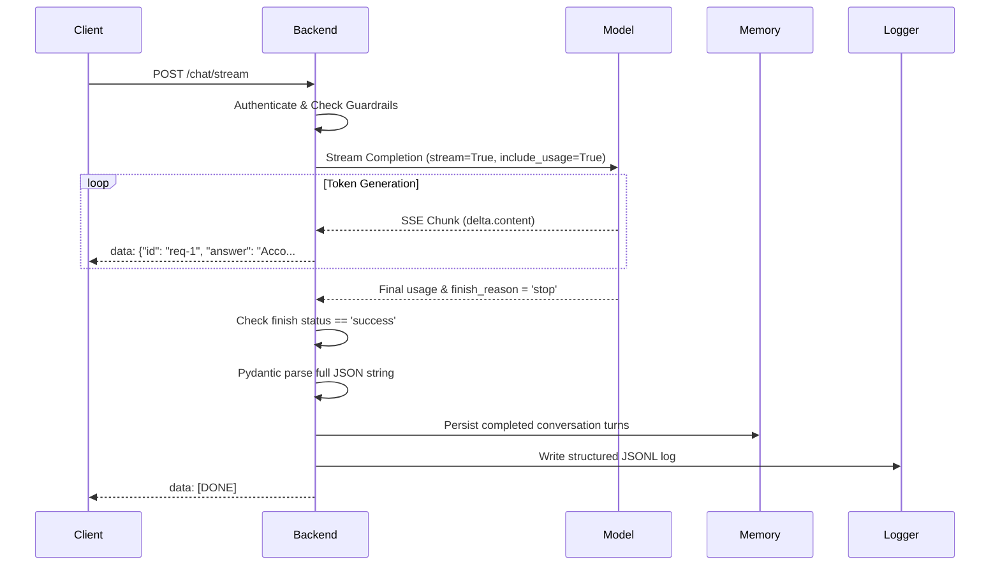

# HR Helpdesk Assistant V1 — System Architecture

This document describes the request–response architecture, data flow, deterministic tool boundary, conversation memory, security layers, and observability pipeline of the **HR Helpdesk Assistant V1**.

---

## 1. High-Level Request–Response Architecture

The application implements a strict deterministic sandwich pattern:  
**Client → FastAPI Backend → LLM (Inference 1) → Deterministic Tool / Policy Ingestion → LLM (Inference 2) → Client**



---

## 2. Sequence Diagram: Deterministic Employee Record Lookup

When an employee requests personal records (e.g., *"How many casual leaves do I have left?"*), the backend prevents model hallucination by enforcing a deterministic lookup:



---

## 3. Policy Q&A Flow (Deterministic Context Injection)

In V1, no vector databases or embedding retrievers are used. Instead, policies are deterministically selected and injected:

1. **Detection:** [detect_policy_name()](file:///c:/Users/dhana/HR%20Assistant/hr-helpdesk-v1/app/main.py) matches normalized query terms against exact policy dictionaries (`leave`, `work_from_home`, `reimbursement`).
2. **Untrusted Data Boundary:** Policy text is loaded from disk ([data/policies/](file:///c:/Users/dhana/HR%20Assistant/hr-helpdesk-v1/data/policies/)) and wrapped inside clear delimiters:
   ```text
   ============================================================
   SUPPLIED HR POLICY DATA - DO NOT CALL A POLICY TOOL
   Policy name: work_from_home
   ... [Exact Policy Text] ...
   END SUPPLIED HR POLICY DATA
   ============================================================
   ```
3. **Model Grounding:** The model is instructed to answer strictly from the supplied text and never invent rules or rely on common-sense assumptions.

---

## 4. Streaming Architecture (Server-Sent Events)

For the `/chat/stream` endpoint, responses are streamed token-by-token:



---

## 5. Security & Isolation Matrix

| Layer | Mechanism | Protection |
| :--- | :--- | :--- |
| **Authentication** | Bearer Token Validation in `authenticate_client` | Rejects unauthenticated callers (HTTP 401). |
| **User Binding** | `request.user_id == authenticated_user_id` | Prevents caller from accessing another employee's scope (HTTP 403). |
| **Catastrophic Guardrails** | Deterministic keyword pre-filter in `check_catastrophic_action` | Blocks salary edits, leave approvals, cross-employee snooping, and prompt disclosures before LLM invocation. |
| **Tool Authorization** | `authorize_employee_access` inside `get_leave_balance` | Hard boundary preventing any backend tool from querying non-authenticated employee records. |
| **Prompt Injection** | Strict data demarcation + system prompt instructions | Treats user queries, history, and policies as untrusted `DATA`. |
| **Inference Status Check** | `require_successful_response` checking `finish_reason` | Rejects truncated, cancelled, or filtered LLM responses before processing. |
